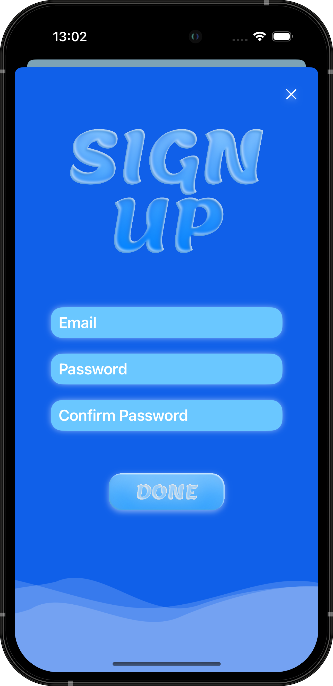

  
    
  
  
  
   
  
    

# MyWater

MyWater is your ultimate companion for tracking daily water intake. Set personalized daily goals by choosing your desired volume and the number of glasses per day. Monitor your progress with a calendar view and analyze your water consumption by day, week, month, or year. Receive daily reminders to stay hydrated and achieve your goals. Drink water, stay healthy, and reach your hydration goals with MyWater!

## App Demo  

  <a href="https://youtu.be/XWWipomukE4">
      
  </a>
  
  [YouTube link to App Demo](https://youtu.be/XWWipomukE4)

## Key Features  

- **Secure Authentication:** Authentication is managed using the Firebase service.
- **Daily Water Consumption Goals:** Set and track your daily water intake goals.
- **Daily Reminders:** Sign up for notifications to help you meet your hydration targets.
- **Consumption History:** View your water consumption history and track your progress with the calendar feature.

## Technologies Used in MyWater  

1. Programming Language: [Swift](https://developer.apple.com/swift/) ([UIKit](https://developer.apple.com/documentation/uikit))
2. Authentication Solution: [FirebaseAuth](https://firebase.google.com/docs/auth)
   - Verification: [Email](https://firebase.blog/posts/2017/02/email-verification-in-firebase-auth)
4. Data Storage: [Firestore](https://firebase.google.com/docs/firestore)
5. Layout Purposes Helper: [SnapKit](https://github.com/SnapKit/SnapKit)
6. Custom Tab Bar Dependencies:
   - [RxGesture](https://github.com/RxSwiftCommunity/RxGesture) for handling tapping on Tab Bar items
   - [RxSwift](https://github.com/ReactiveX/RxSwift) for informing the TabBarController that item has been tapped
7. Custom View Forms: [UIBezierPath](https://developer.apple.com/documentation/uikit/uibezierpath)
8. Library for displaying messages to the user about the status of settings: [Toast-Swift](https://github.com/scalessec/Toast-Swift)

## Start App  

To run this project on your local machine, follow these steps:
1. Create a [Firebase](https://firebase.google.com) Project:
   - Register on Firebase and create a new project.
   - Select the iOS platform and fill in the required details.
   - Download the GoogleService-Info.plist file.
   - Follow the instructions on the Firebase website to complete ios project setup.
2. Add the Configuration File:
   - Place the GoogleService-Info.plist file in the MyWater folder of your project.
3. Set Up Firebase Services:
   - Enable Authentication and select the Email/Password provider.
   - Enable Firestore Database:
     - Set the name and location.
     - Secure rules: Start in test mode.

## Screenshots  

  
  
  
  
  
  
  
  
  

